## Hands-on IoT / IBM CodeDay MVD 2019


En este repo encontrará los pasos para el Hands-on de IoT! Veremos Que es y como funciona Watson IoT Platform y generamos una simulación en la nube usando dicha plataforma y node-red.


<p align="center">
  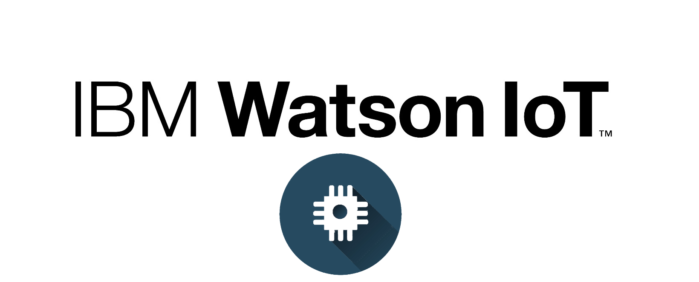
</p>


## Prerrequisitos


### Cuenta Free en IBM Cloud


El único prerrequisito para esta Hands-on es contar con una cuenta free en IBM Cloud. 


Puede crear su cuenta haciendo clic [aqui](/POner el link)


## ¿Qué es Watson IoT Platform? 


Watson IoT Platform es una plataforma en la nube de IBM que nos permite conectar, administrar y analizar de forma segura los datos de nuestros dispositivos IoT.


<p align="center">
  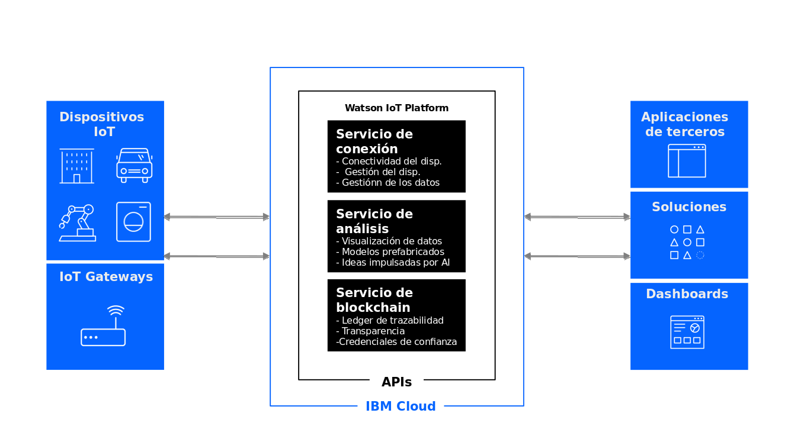
</p>


### Servicio de Conexión


 Al brindar un servicio de conexión brinda conectividad e integración segura y escalable para IoT.
La comunicación está basada en estándares abiertos para IoT como lo son:


* MQTT: Ligero, eficiente, bidireccional y optimizado para IoT
* HTTP: Amplio alcance y seguridad para llegar a más dispositivos


También dentro de esta categoría se brindan herramientas para la administración flexible de dispositivos y sistemas. 


* **Gestión de dispositivos:**


La consola de administración de dispositivos flexible proporciona un medio preconfigurado para enviar eventos tales como reinicio del dispositivo, reinicio de fábrica o funciones personalizadas del dispositivo, tales como administración de firmware y actualizaciones.


* **Gestion de gateways:**


Funcionalidad y control adicionales de gateways, que permite acciones de conexión única, registros automáticos y administración de dispositivos en dispositivos conectados como entidades direccionables por separado


* **Plataforma de Plataformas:**


Watson IoT Platform se puede integrar con otras plataformas, incluidas plataformas de administración de redes y dispositivos de terceros, y permite la administración del sistema con servicios especializados como AT&T Control Center, Jasper, Orange SIM


<p align="center">
  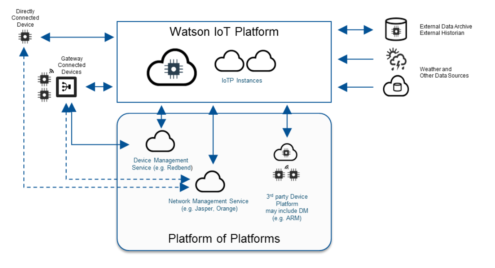
</p>


Para almacenar los datos podemos usar Data Lifecycle Management para optimizar la utilización del almacenamiento y reducir los costos, al tiempo que conserva la flexibilidad.


La gestión del ciclo de vida de los datos se encarga de limitar el crecimiento de los datos en los diversos almacenes dentro de la solución. Sin esto, el tamaño de los datos aumentaría continuamente y los costos asociados crecerían. Data Lifecycle purga automáticamente los datos más antiguos y mueve los datos a largo plazo al almacenamiento de bajo costo.


Para este dojo integraremos Watson IoT Platform con Cloudant para almacenar allí toda la información de nuestros dispositivos. 


### Servicio de Análisis


Este servicio de Watson IoT Platform nos permite explorar, visualizar y obtener información de nuestros datos con análisis basados en inteligencia artificial. 
Entre las principales características que nos brinda este servicio podemos encontrar:


* Explorar y Visualizar patrones de datos de nuestros datos IoT
* Enriquecer los datos con funciones analíticas que se centran en los KPI empresariales
* Modelos avanzados y personalizados que incluyen AI


## Hands-on - Objetivo


El objetivo de este hands-on es realizar una simulación de varios dispositivos que se conecten de forma simultánea con la plataforma. Utilizaremos Node-Red para programar la simulación de la conectividad y datos de los dispositivos. Desde Node-Red enviaremos la información a Watson IoT platform donde podremos configurar y mostrar en tiempo real el estado y la información de esos dispositivos y por último utilizaremos Cloudant para almacenar todos los datos de los mismos. 


### Starter Kit


En la nube de IBM hay un starter kit que nos crea los 3 servicios que precisamos para este hands-on. Para crearlo debemos ingresar en nuestra cuenta de IBM Cloud, dirigirnos a catalogo y alli seleccionar en el lateral izquierdo "Starter Kits". Una vez alli busquemos **Internet of Things Platform Starter** y hagamos clic en el para abrirlo.  


<p align="center">
  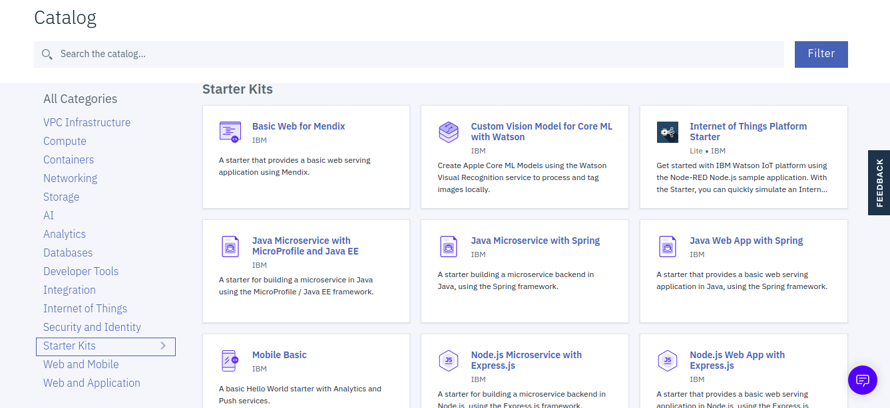
</p>


Ahora creemos nuestro starter kit. Debemos seleccionar un nombre único para nuestro host, luego del resto de las configuraciones no modifiquemos nada. 


<p align="center">
  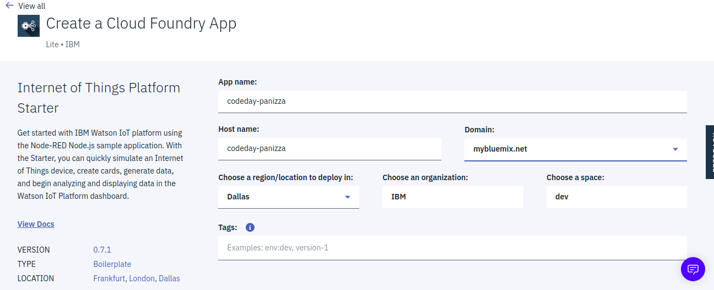
</p>


Debajo veremos los servicios en la nube que se nos van a crear:


* Cloud Foundry: En este servicio se va a desplegar Node-Red y podremos acceder a el por medio del host que indicamos al crear el starter kit
* Cloudant: Uno de los servicios de base de datos dentro del catalogo de PaaS de IBM Cloud, lo usaremos para almacenar los datos de nuestros dispositivos IoT
* Watson IoT Platform


<p align="center">
  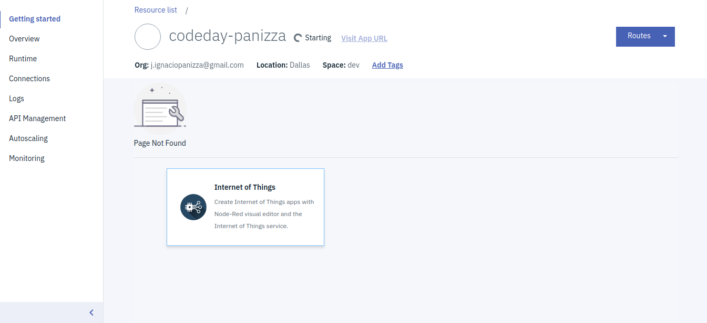
</p>


Luego de crear el starter kit, seremos redireccionados al servicio de Cloud Foundry, en un principio (y como se ve en la imagen de abajo) veremos que dice "starting". Esperamos unos segundo y recarguemos la página, si todo salio bien debería aparecernos "running". De ser asi hagamos clic sobre "Visit App Url"


### Pasos Iniciales Node-Red


Una vez que accedemos a la url de nuestra aplicación Cloud Foundry, tendremos que seguir los pasos en pantalla para configurar Node-Red. 


Debemos configurar un usuario para limitar el acceso al editor, si desean pueden seleccionar la ultima opción que permite acceder al editor sin credenciales. 


<p align="center">
  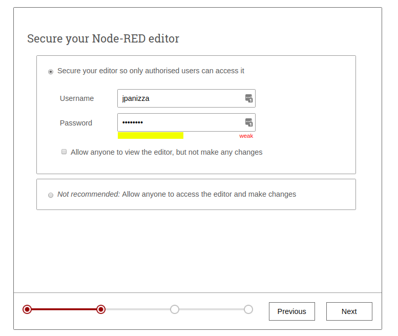
</p>


Luego hagamos clic en "Next" y tendremos listo Node-Red!


<p align="center">
  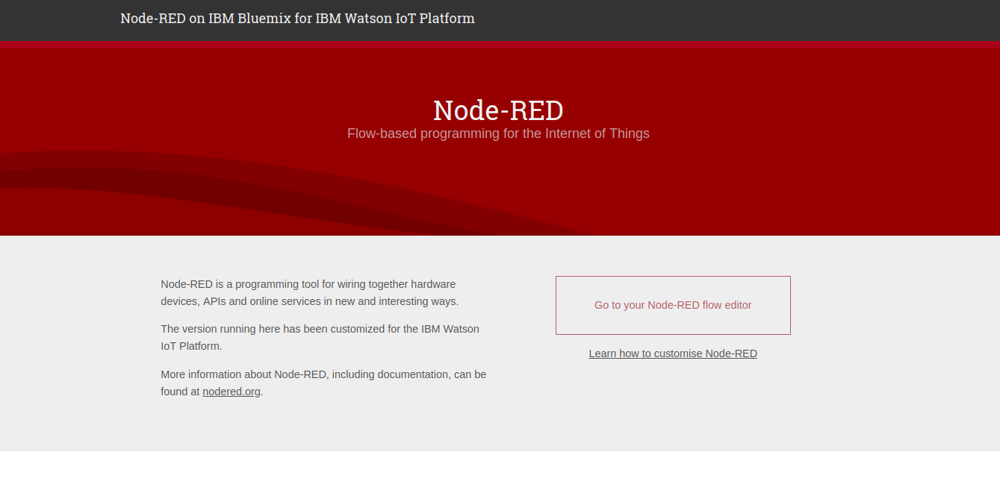
</p>


Vayamos al editor haciendo clic en "Go to your Node-Red flow editor", deben utilizar las credenciales que indicaron en el paso anterior. Allí veremos que hay un par de nodos creados, al crearse el servicio desde un starter kit de IoT, por defecto nos creará una demostración. Más adelante vamos a trabajar en base a estos nodos ya creados, por el momento dejemos abierto Node-Red y trabajemos en otra pestaña.


<p align="center">
  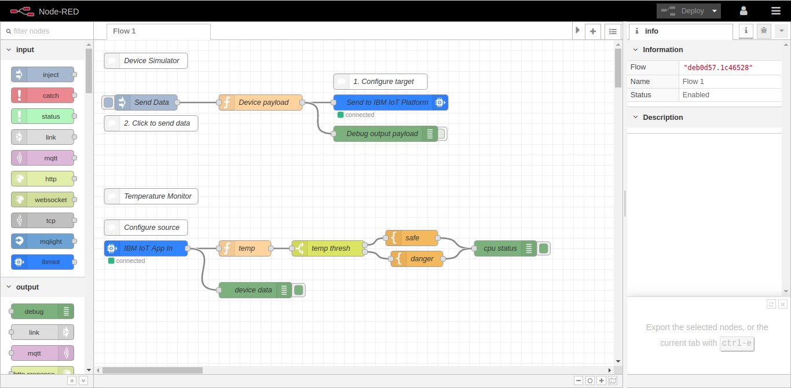
</p>


### Watson IoT Platform


Ahora vayamos al servicio de WIoTP que fue creado junto al starter kit. Vayamos a lista de nuestros recursos en IBM Cloud, esta opción se puede encontrar desplegando el menú lateral izquierdo de la nube y haciendo clic en la segunda opción "Resource List". 


<p align="center">
  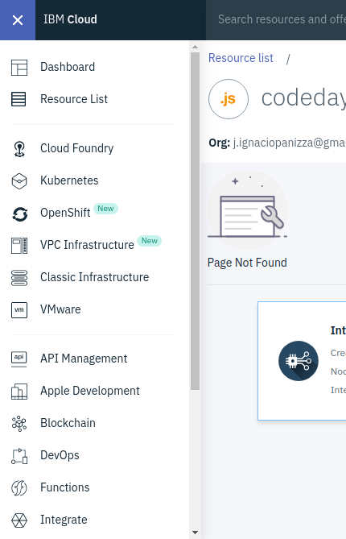
</p>


El servicio esta agrupado en la pestaña "Cloud Foundry Services", hagamos clic en el para abrirlo. 


Una vez alli, hagamos clic en "Launch" para acceder a la plataforma. 


<p align="center">
  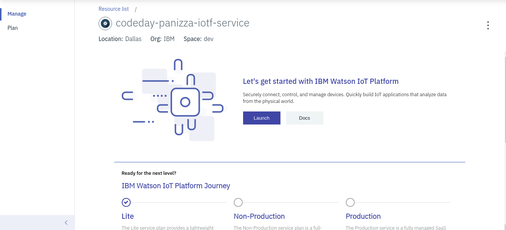
</p>


Una vez en la plataforma, lo primero que haremos será vincular nuestro servicio de Cloudant para poder almacenar allí los datos de nuestros futuros dispositivos. Para hacer esto, vayamos al menú lateral izquierdo y hagamos clic en la última opción "Extensions". 


<p align="center">
  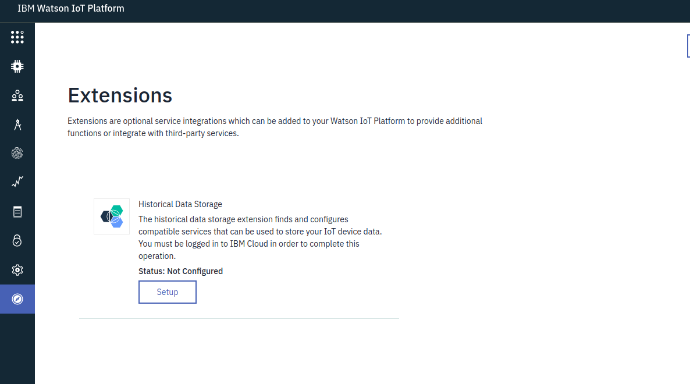
</p>


Una vez alli, por defecto podremos ver que nos da la posibilidad de configurar storage para el almacenaje de los datos. Hagamos clic en "Setup". Luego se nos desplegara un menu con todos los servicios en nuestra cuenta de IBM Cloud que podremos usar. Seleccionemos el de Cloudant que se creó junto al starter kit. 


<p align="center">
  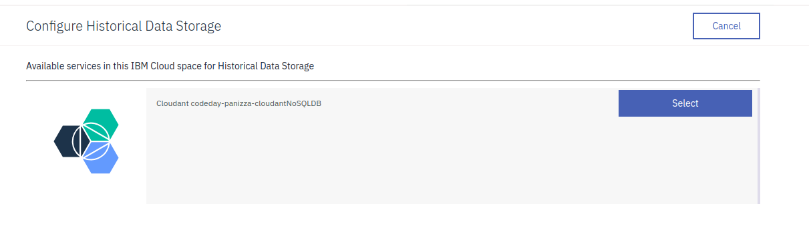
</p>


Luego podremos configurar el intervalo del bucket, la zona horaria y el nombre de la base de datos. 


<p align="center">
  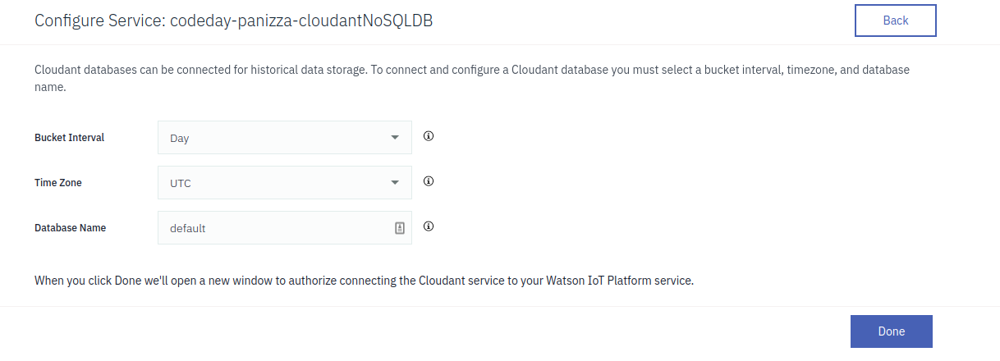
</p>


Al finalizar seremos redireccionados a una página donde debemos confirmar la conexión entre ambos servicios.


Una vez que hayamos configurado Cloudant para almacenar los datos de nuestros dispositivos, podemos volver a la pestaña "Extensions" donde verificaremos que los servicios hayan quedado conectados correctamente. 


<p align="center">
  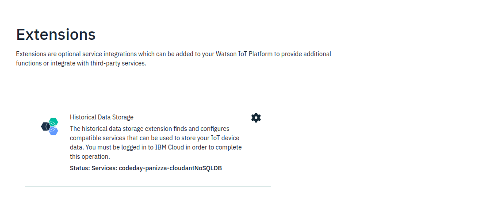
</p>


### Agregar dispositivos 


Ahora prosigamos con la creación de los dispositivos. Los dispositivos tienen un tipo, por lo tanto lo primero que debemos hacer es crear este. Todo lo relacionado con la administración de dispositivos se encuentra en la sección **Devices**, podemos acceder a ella desde el menú lateral izquierdo. 


<p align="center">
  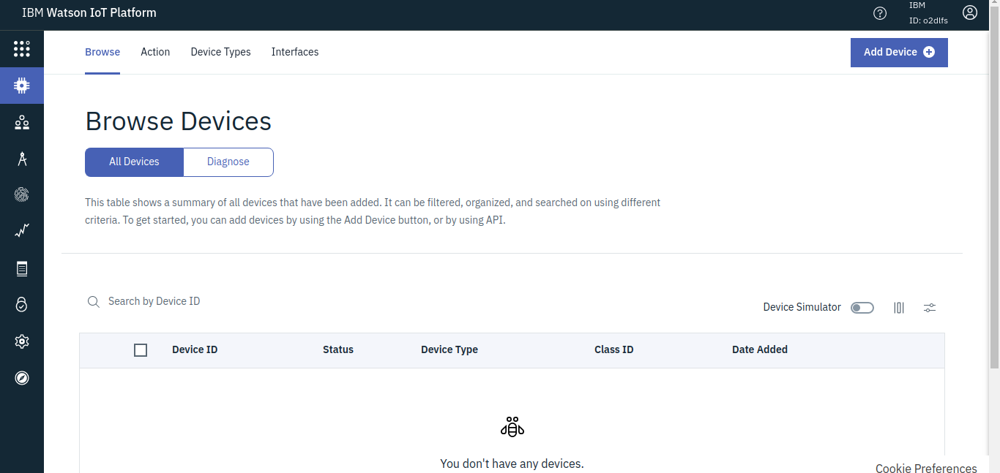
</p>


Para el propósito del workshop, creemos en principio un solo tipo de dispositivo para identificar los dispositivos con sensores de temperatura y humedad


Desde la sección **Device** hagamos clic en "Device Types" que se encuentra entre las opciones superiores y luego en "Add Device Type"


Completamos los campos de nombre y descripción. 


<p align="center">
  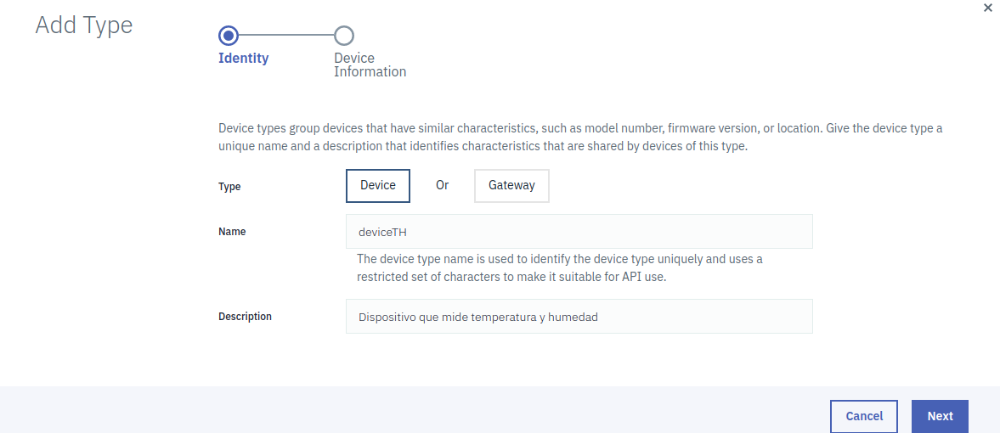
</p>


Luego hagamos clic en *Next* y *Finish*, para el propósito de este hands-on no hace falta ninguna otra configuración.


Ahora aparecerá en la lista el tipo de dispositivo que creamos.


<p align="center">
  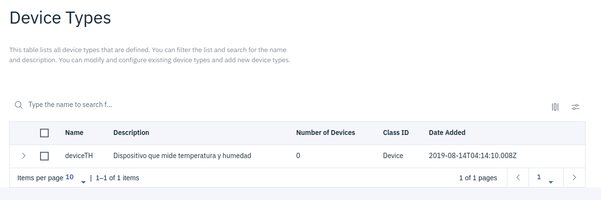
</p>


Hagamos clic en "Browse" que se encuentra en la parte superior y luego en **Add Device** para agregar un nuevo dispositivo. 


Seleccionemos el tipo de dispositivos que creamos anteriormente y escribamos un nombre para poder identificarlo. 


<p align="center">
  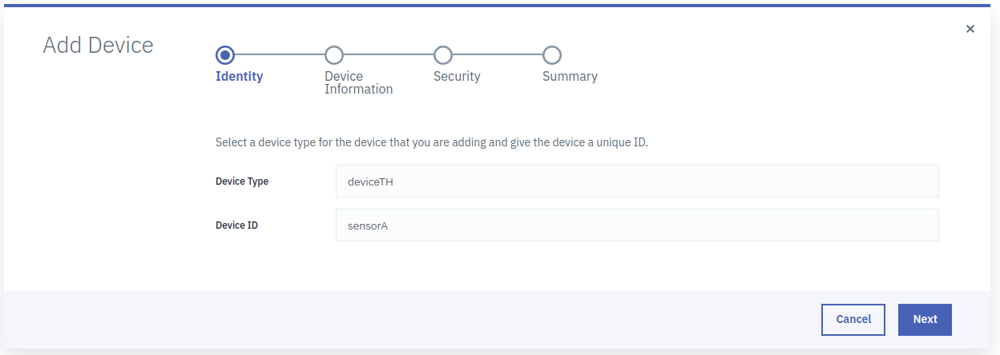
</p>


Al igual que en el caso anterior, no realizaremos ninguna otra configuración adicional. Una vez creado el dispositivo veremos los datos del mismo y el Token (que solo lo veremos en esta oportunidad). 


Hagamos lo mismo para crear un segundo dispositivo. 


<p align="center">
  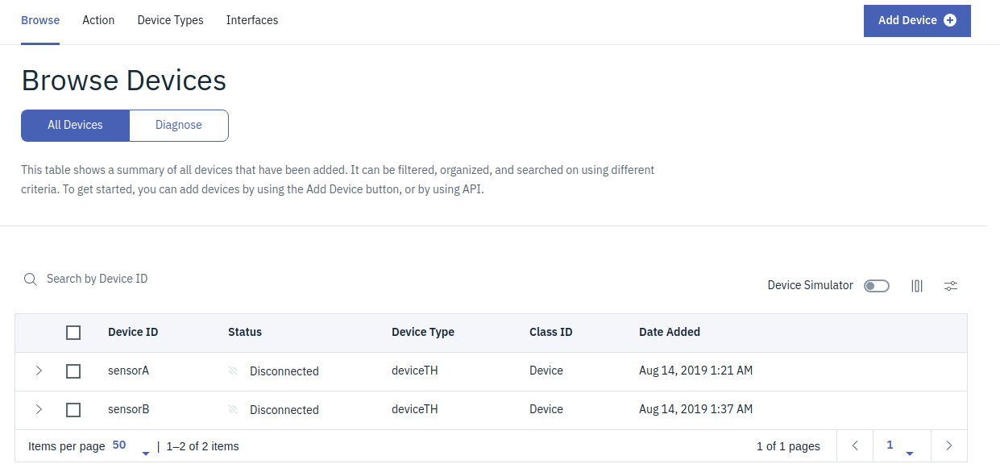
</p>


### Obtener información del dispositivo 


Usaremos Node-Red para simular la información que estos dispositivos emiten. Este proceso no varía mucho en caso de que tengamos realmente el dispositivo con nosotros ya que, también podemos usar Node-Red para recibir y procesar la información antes de enviarla a Watson IoT Platform. Por ejemplo, si tenemos un dispositivo SigFox podemos generar una callback a un gateway en Watson IoT Platform y  recoger el payload con Node-Red, procesarlo y enviarlo al dispositivo en la plataforma. En este ejemplo vamos a implementar un nodo función que se va a encargar de generar ese payload para enviarlo al dispositivo en la plataforma y desde alli guardar la información en Cloudant y generar un dashboard para visualizarla. 


Volvamos a nuestro editor en Node-Red.


Para tener un espacio de trabajo más claro, podemos eliminar todos los nodos de abajo y quedarnos solo con los de arriba que son aquellos que vamos a utilizar. 


<p align="center">
  
</p>


Tenemos un nodo llamado "Send data" que al activarlo ejecuta el nodo función llamado "Device payload". Luego la información que devuelve este nodo es enviada a un dispositivo X en nuestra plataforma. La conexion entre Node-Red y Watson IoT Platform se genera automaticamente al crear el starter kit. 


Lo primero que haremos será modificar el nodo "Send data", hagamos clic sobre el configuremos para que se active cada 10 segundos.


<p align="center">
  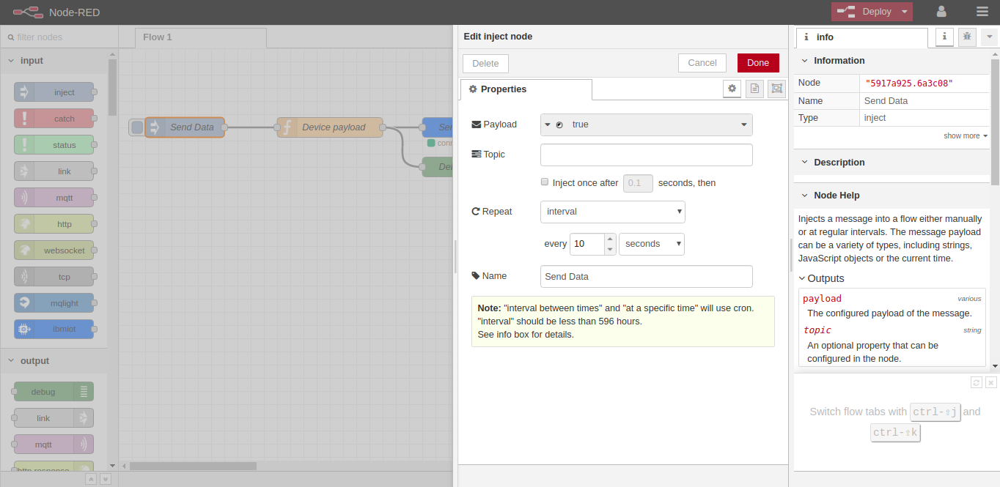
</p>


Luego vayamos al último nodo "Send to..." y modifiquemos *Device Type* por el tipo que creamos y en *DeviceId* escribamos el nombre de uno de nuestros dispositivos. 


<p align="center">
  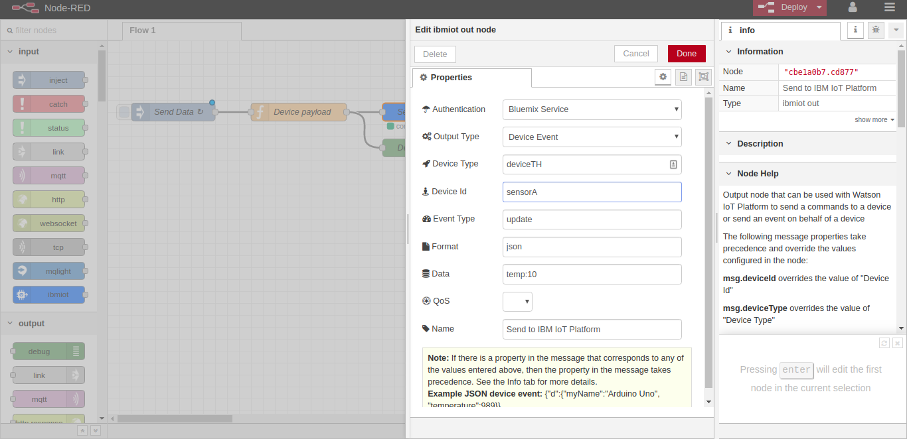
</p>


Ahora analicemos la función en el nodo del medio.


```
// Thermostat's location:
var longitude1 = -98.49;
var latitude1 = 29.42;


// Array of pseudo random temperatures
var temp1 = [15,17,18.5,20,21.5,23,24,22.2,19,18];


// Array of pseudo random relative humidities
var humidity1 = [50,55,61,68,65,60,53,49,45,47];


// Counter to select from array.
var counter1 = context.get('counter1')||0;
counter1 = counter1+1;
if(counter1 > 9) counter1 = 0;
context.set('counter1',counter1);


// Create MQTT message in JSON
msg = {
  payload: JSON.stringify(
    {
      d:{
        "temp" : temp1[counter1],
        "humidity" : humidity1[counter1],
        "location" :
        {
          "longitude" : longitude1,
          "latitude" : latitude1
        },
      }
    }
  )
};
return msg;
```
 Vemos que devuelve un payload con un valor de temperatura, humedad y ubicación (lat y long). Los valores de temperatura y humedad los toma de un array. En caso de recibir la información de un dispositivo lo que se hace en este nodo en interpretar el payload y enviar al nodo siguiente (el que envia a Watson Iot Platform) los datos que nos interesen. Dejemoslo asi por el momento. 
 


 Hagamos clic en Deploy (arriba a la derecha) y volvamos a Watson IoT Platform. 


### Crear un tablero con el estado de los dispositivos


En Watson Iot Platform vayamos a la sección **boards** en el menú lateral izquierdo y hagamos clic en *Create New Board*. Ingresemos un nombre y hagamos clic en crear. 


<p align="center">
  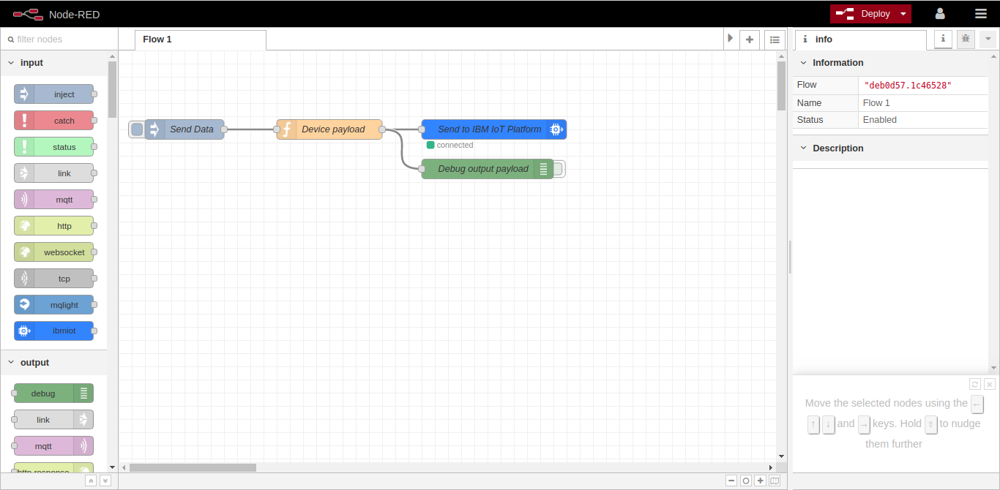
</p>


Por defecto nos va a cargar un tablero con algunas tarjetas con información general. Vamos a borrarlas y a hacer clic en "Add new card"


Creemos una "Value Card", en el primer paso seleccionamos el dispositivo del cual vamos a mostrar la información, elijan el mismo que hayan puesto en Node-Red. 


<p align="center">
  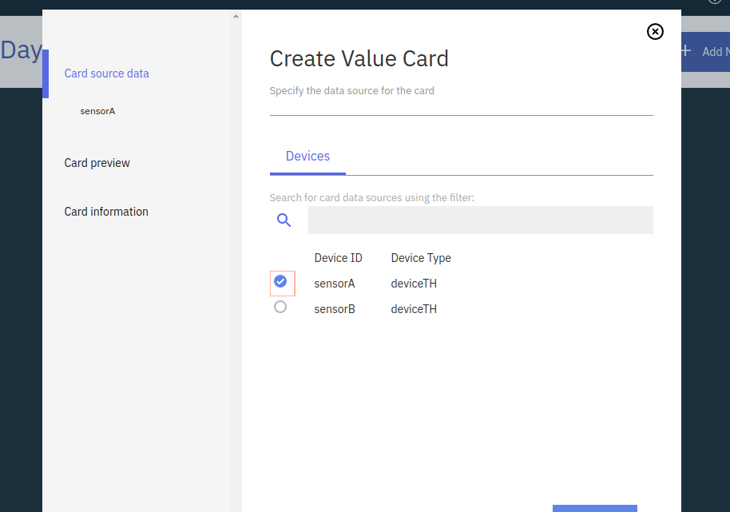
</p>


En el siguiente paso seleccionamos la información que queremos mostrar, en este caso la temperatura. Recordemos que la función en Node-Red guardaba la temperatura en el payload como "temp". En event debemos indicar "update". 


<p align="center">
  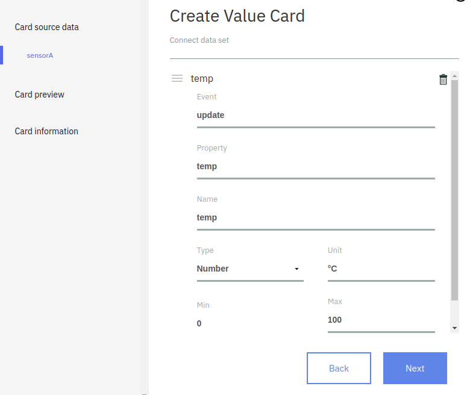
</p>


En la siguiente pestaña podemos configurar el estilo y tamaño de la tarjeta. Luego ya tendremos la información con la temperatura de nuestro dispositivo en el board, actualizándose en tiempo real cada 10 segundos (tiempo que establecimos en Node-Red)


<p align="center">
  
</p>


Ahora creemos otra igual pero para ver la humedad.Tambien creemos una con una grafica y otra para ver la informacion del dispositivo. Deberia quedarles parecido a esto:


<p align="center">
  
</p>

### Cloudant 

Ahora vayamos al servicio de cloudant 
